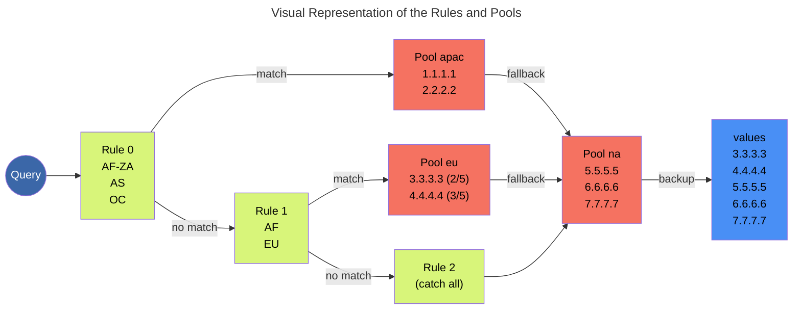

## Dynamic Record Support

Dynamic records provide support for GeoDNS and weighting to records. `A` and `AAAA` are fully supported and reasonably well tested for both Dyn (via Traffic Directors) and Route53. There is preliminary support for `CNAME` records, but caution should be exercised as they have not been thoroughly tested.

Configuring GeoDNS is complex and the details of the functionality vary widely from provider to provider. octoDNS has an opinionated view mostly to give a reasonably consistent behavior across providers which is similar to the overall philosophy and approach of octoDNS itself. It may not fit your needs or use cases, in which case please open an issue for discussion. We expect this functionality to grow and evolve over time as it's more widely used.

### An Annotated Example

```yaml

---
test:
  # This is a dynamic record when used with providers that support it
  dynamic:
    # These are the pools of records that can be referenced and thus used by rules
    pools:
      apac:
        # An optional fallback, if all of the records in this pool fail this pool should be tried
        fallback: na
        # One or more values for this pool
        values:
        - value: 1.1.1.1
        - value: 2.2.2.2
      eu:
        fallback: na
        values:
        - value: 3.3.3.3
          # Weight for this value, if omitted the default is 1
          weight: 2
        - value: 4.4.4.4
          weight: 3
      na:
        # Implicitly goes to the backup pool (below) if all values are failing
        # health checks
        values:
        - value: 5.5.5.5
        - value: 6.6.6.6
        - value: 7.7.7.7
    # Rules that assign queries to pools
    rules:
    - geos:
      # Geos used in matching queries
      - AF-ZA
      - AS
      - OC
      # The pool to service the query from
      pool: apac
    - geos:
      # AF-ZA was sent to apac above and the rest of AF else goes to eu here,
      # sub-locations (e.g. AF-ZA) should come before their parents (AF.) If a
      # more specific geo occured after a general one requests in that
      # location would have already matched the previous rule. For the same
      # reasons locations may not be repeated in multiple rules.
      - AF
      - EU
      pool: eu
    # No geos means match all queries, the final rule should generally be a
    # "catch-all", served to any requests that didn't match the preceeding
    # rules. The catch-all is the only case where a pool may be re-used.
    - pool: na
  ttl: 60
  type: A
  # These values become a non-healthchecked backup/default pool, generally it
  # should be a superset of the catch-all pool and include enough capacity to
  # try and serve all global requests (with degraded performance.) The main
  # case they will come into play is if all dynamic healthchecks are failing,
  # either on the service side or if the providers systems are expeiencing
  # problems. They will also be used for when the record is pushed to a
  # provider that doesn't support dynamic records.
  values:
  - 3.3.3.3
  - 4.4.4.4
  - 5.5.5.5
  - 6.6.6.6
  - 7.7.7.7
```

If you encounter validation errors in dynamic records suggesting best practices that you have specific reasons for not following see [docs/records.md#Lenience](/docs/records.md#Lenience) for how to turn the errors into warnings. Doing so is taking on the burden of thoroughly testing and verifying that what you're doing behaves the way you expect. You may well encounter situations where the octoDNS providers and/or the underlying DNS services do not behave as desired.

#### Visual Representation of the Rules and Pools




#### Geo Codes

Geo codes consist of one to three parts depending on the scope of the area being targeted. Examples of these look like:

* 'NA-US-KY' - North America, United States, Kentucky
* 'NA-US' - North America, United States
* 'NA' - North America

The first portion is the continent:

* 'AF': 14,  # Continental Africa
* 'AN': 17,  # Continental Antarctica
* 'AS': 15,  # Continental Asia
* 'EU': 13,  # Continental Europe
* 'NA': 11,  # Continental North America
* 'OC': 16,  # Continental Australia/Oceania
* 'SA': 12,  # Continental South America

The second is the two-letter ISO Country Code https://en.wikipedia.org/wiki/ISO_3166-2 and the third is the ISO Country Code Subdivision as per https://en.wikipedia.org/wiki/ISO_3166-2:US. Change the code at the end for the country you are subdividing. Note that these may not always be supported depending on the providers in use.

#### Subnets

Dynamic record rules also support subnet targeting in some providers:

```
...
    rules:
    - geos:
      - AS
      - OC
      subnets:
      # Subnets used in matching queries
      - 5.149.176.0/24
      pool: apac
...
```

### Rule ordering

octoDNS has validations in place to ensure that sources have the rules ordered from the most specific match to the least specific match per the following categories:

1. Subnet-only rules
2. Subnet+Geo rules
3. Geo-only rules
4. Catch-all rule (with no subnet or geo matching)

The first 3 categories are optional, while the last one is mandatory.

Subnet targeting is considered more specific than geo targeting. This means that if there is a subnet rule match as well as a geo rule match, subnet match must take precedence. Provider implementations must ensure this behavior of targeting precedence.

### Health Checks

octoDNS will automatically configure the provider to monitor each IP and check for a 200 response for **https://<ip_address>/_dns**.

These checks can be customized via the `healthcheck` configuration options.

```yaml

---
test:
  ...
  octodns:
    healthcheck:
      host: my-host-name
      path: /dns-health-check
      port: 443
      protocol: HTTPS
  ...
```

| Key  | Description | Default |
|--|--|--|
| host | FQDN for host header and SNI | - |
| path | path to check | _dns |
| port | port to check | 443 |
| protocol | HTTP/HTTPS/TCP | HTTPS |

Healthchecks can also be skipped for individual pool values. These values can be forced to always-serve or never-serve using the `status` flag.

`status` flag is optional and accepts one of three possible values, `up`/`down`/`obey`, with `obey` being the default:

```yaml
test:
  ...
  dynamic:
    pools:
      na:
        values:
        - value: 1.2.3.4
          status: down
        - value: 2.3.4.5
          status: up
        - value: 3.4.5.6
          # defaults to status: obey
  ...
```

Support matrix:
* NS1 and Azure DNS support all 3 flag values
* All other dynamic-capable providers only support the default `obey`

See "Health Check Options" in individual provider documentation for customization support.
